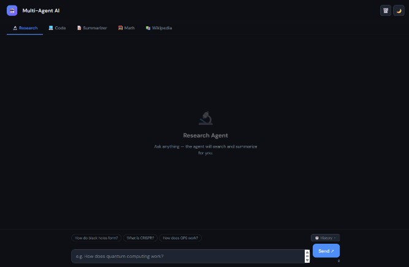
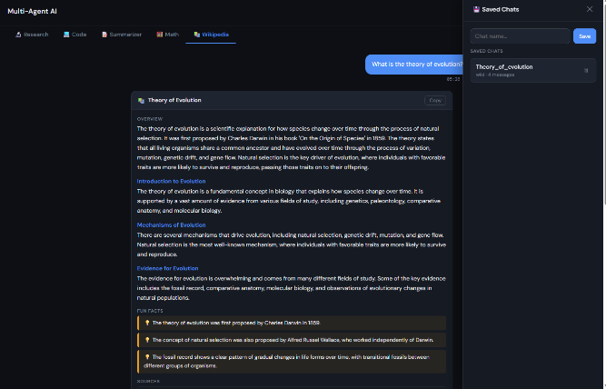

# Multi-Agent AI
A local multi-agent AI assistant with 5 specialist agents built with Python, Flask, and Groq.



---
## Agents
| Agent | What it does |
|---|---|
| 🔬 Research | Searches the real web and summarizes findings with sources |
| 💻 Code | Writes and reviews code in any language |
| 📝 Summarizer | Summarizes pasted text or uploaded files (PDF, TXT, DOCX) |
| 🧮 Math | Solves math problems step by step |
| 📚 Wikipedia | Deep-dive breakdowns on any topic |
---
## Features
- **Real web search** via Tavily API (Wikipedia fallback if no key)
- **Agentic tool-use loop** — model autonomously decides what to search and when to stop
- **Multi-turn memory** — follow-up questions work within each agent session
- **File upload** — drag and drop PDF, TXT, or DOCX into the Summarizer
- **Conversation save/load** — save any chat and reload it later
- **Edit messages** — hover any sent message to edit and resend
- **Real-time streaming** — see the agent thinking via SSE
- **Auto-retry** — handles rate limits and server errors automatically
- **Dark / light mode**
- **Voice input** (Chrome only)
- **Rate limiting + input sanitization** — basic security hardening
---
## Tech Stack
| Layer | Technology |
|---|---|
| Backend | Python 3.10+, Flask |
| AI Model | Groq API — qwen/qwen3.6-27b |
| Web Search | Tavily API / Wikipedia API (fallback) |
| File Reading | PyMuPDF (PDF), zipfile (DOCX) |
| Frontend | Vanilla HTML + CSS + JavaScript |
| Streaming | Server-Sent Events (SSE) |
---
## Project Structure
multi-agent-ai/
├── server.py # Flask backend

├── requirements.txt

├── .env # Your API keys (not committed)

├── .gitignore

├── agents/

│ ├── init.py

│ ├── utils.py # Retry logic

│ ├── tavily_search.py # Web search

│ ├── research_agent.py

│ ├── code_agent.py

│ ├── summarizer_agent.py

│ ├── math_agent.py

│ └── wiki_agent.py

├── static/

│ └── index.html # Frontend UI

└── screenshots/

└── ui.png
---
## Setup
### 1. Clone the repo
```bash
git clone https://github.com/your-username/your-repo-name.git
cd your-repo-name
```
### 2. Create and activate virtual environment
```bash
# Windows
python -m venv venv
venv\Scripts\activate
# Mac / Linux
python -m venv venv
source venv/bin/activate
```
### 3. Install dependencies
```bash
pip install -r requirements.txt
```
### 4. Get your API keys
| Key | Where to get it | Required |
|---|---|---|
| `GROQ_API_KEY` | [console.groq.com](https://console.groq.com) — free | ✅ Yes |
| `TAVILY_API_KEY` | [tavily.com](https://tavily.com) — free 1000/month | Optional |
### 5. Create a `.env` file in the project root
GROQ_API_KEY=gsk_your-key-here
TAVILY_API_KEY=tvly-your-key-here
### 6. Run the server
```bash
python server.py
```
### 7. Open in browser
http://localhost:5000
---
## How the Agentic Loop Works
User query
│
▼
Groq model receives query + tool definitions
│
├── calls web_search → gets results → feeds back
│
├── calls fetch_page → reads content → feeds back
│
├── calls summarize_findings → structures output
│
└── end_turn → streams final result to browser
The model decides autonomously how many searches to run,
which pages to read, and when it has enough information to answer.
---
## Notes
- Voice input requires Chrome and only works on `https://` by default.
  To enable on localhost, launch Chrome with:
  `--unsafely-treat-insecure-origin-as-secure=http://localhost:5000`
- The `saved_chats/` and `logs/` folders are created automatically and excluded from git.
- Groq models change frequently. If you get a `model_decommissioned` error,
  update the `MODEL` variable in each agent file. Current model: `qwen/qwen3.6-27b`
---
## License
MIT

now add both screenshots in this ui1 and ui2
